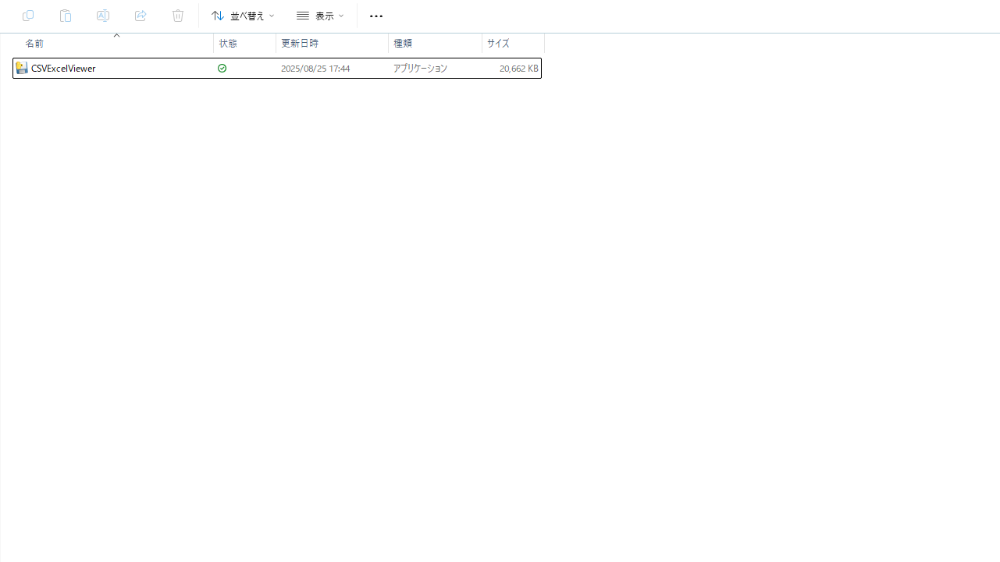
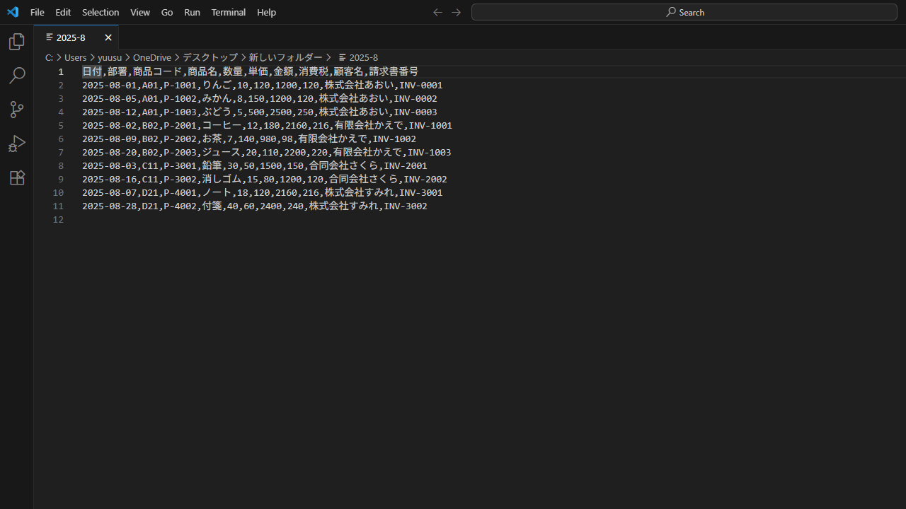

# CSVExcelViewer
# CSVExcelViewer — CSV/Excel結合 & ビューア (TkEasyGUI)

[](#license)
[](#%E5%BF%85%E8%A6%81%E7%92%B0%E5%A2%83)
[]()

CSV と Excel（.xlsx/.xlsm）を **まとめて読み込み→結合→テーブルでプレビュー→CSV保存** まで行える Windows デスクトップツールです。  
Tkinter ベースの軽量 GUI フレームワーク **TkEasyGUI** を採用し、非エンジニアにも扱いやすい操作性を意識しています。

> 📦 すぐ使いたい方は **Releases** から `CSVExcelViewer.exe` をダウンロードしてください。

---

## 主な機能

- CSV / Excel（.xlsx / .xlsm）の**同時選択 & 結合**
- 文字コード（utf-8-sig / UTF-8 / CP932 / EUC-JP）と区切り文字（`,` `;` `\t` `|`）の**自動判定**
- ヘッダー行の**重複スキップ**、**空行スキップ**
- GUI テーブルで**プレビュー**し、そのまま **UTF-8(BOM) でCSV保存**
> 実装の要点は `src/csv_excel_viewer.py` を参照してください。

---

## 画面イメージ（例）

## スクリーンショット

起動 → 結合 → 保存までの流れ：






---

## 必要環境

- Windows 10 / 11
- Python 3.10 以上（実行のみなら EXE も可）

---

## セットアップ（ソースから実行）

```bash
# 1) 仮想環境は任意。ここでは venv の例
python -m venv .venv
.venv\Scripts\activate

# 2) 依存ライブラリのインストール
pip install -r requirements.txt

# 3) 実行
python src/csv_excel_viewer.py
```

---

## 使い方

1. **ファイル選択**を押して、CSV と Excel を複数選択（ドラッグ選択可）  
2. プレビュー画面で内容を確認（列幅は自動調整）  
3. **保存** を押して結合結果を CSV で出力（UTF-8 BOM）

---

## フォルダ構成

```
CSVExcelViewer/
├─ src/
│   └─ csv_excel_viewer.py
├─ screenshots/        # スクショやGIF（任意）
├─ examples/           # サンプルCSV/Excel（任意）
├─ .gitignore
├─ requirements.txt
├─ LICENSE
└─ README.md
```


---


## EXE の作り方（Windows / PowerShell）

> 前提：リポジトリ直下に `src/csv_excel_viewer.py` がある構成。

```powershell
# 0) ルートへ
cd <あなたのパス>\CSVExcelViewer

# 1) 仮想環境
py -3 -m venv .venv

# 2) PowerShellだけ：このセッションで実行許可
Set-ExecutionPolicy -Scope Process -ExecutionPolicy RemoteSigned

# 3) 有効化
.\.venv\Scripts\Activate.ps1

# 4) 依存インストール
.\.venv\Scripts\python.exe -m pip install -r requirements.txt
# 無ければ:
# .\.venv\Scripts\python.exe -m pip install TkEasyGUI openpyxl

# 5) PyInstaller → ビルド
.\.venv\Scripts\python.exe -m pip install pyinstaller
cd src
pyinstaller --noconsole --onefile csv_excel_viewer.py
```
>出力物
- onefile：src\dist\csv_excel_viewer.exe
- onedir：src\dist\csv_excel_viewer\csv_excel_viewer.exe
- 相対パスで動く実装のため、**任意フォルダへ移動しても動作**します。
>よくあるエラー
- activate が見つからない → Activate.ps1 を使う
- 実行ポリシー → 上記の Set-ExecutionPolicy を先に実行
- pyinstaller が見つからない → 仮想環境の Python で ... -m pip install pyinstaller

### Releases からダウンロード（推奨）

ビルドせずに使いたい方は、こちらから最新版の実行ファイルを取得できます：

- 👉 **[Releases からダウンロード](https://github.com/<yourname>/CSVExcelViewer/releases/latest)**  
  （Assets 内の `csv_excel_viewer.exe` または ZIP を保存してください）

**使い方（Windows 10/11）**
1. ダウンロードした `csv_excel_viewer.exe` を任意のフォルダに置く  
2. ダブルクリックで起動（ポータブル／インストール不要）

> ⚠️ SmartScreen が表示された場合  
> 「詳細情報」→「実行」を選択してください（自作アプリの初回実行時に出ることがあります）。

**整合性チェック（任意）**
```powershell
# ダウンロードしたEXEの場所で実行
Get-FileHash .\csv_excel_viewer.exe -Algorithm SHA256
```
---

## よくある質問（FAQ）

- **Q. 文字化けします。**  
  A. 主要な文字コードを自動判定しますが、稀に判定できない場合があります。CSV を UTF-8(BOM) に変換してからお試しください。

- **Q. 大きなファイルで固まります。**  
  A. 現在はメモリ上で結合しています。将来的に分割読み込みに対応予定です（Issue で要望ください）。

---

## 開発者向けメモ

- UI は Tkinter をラップする **TkEasyGUI** を使用
- CSV の**区切り文字**は `csv.Sniffer` による推定を優先、失敗時は Excel 既定の `,` を採用
- Excel 読み込みは **openpyxl**（`read_only=True`, `data_only=True`）を使用

---

## ライセンス

本ソフトウェアは MIT License の下で配布します。詳細は [LICENSE](./LICENSE) をご覧ください。

---

## Author

- name:小熊優介(@oy0415)
- お仕事のご相談は Issues またはプロフィールの連絡先へ
